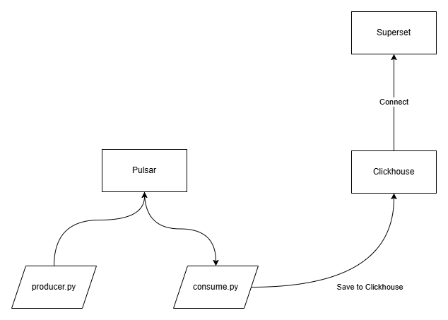

# PoC Durian

This is demo for IoT Project.

**Current Techstack**
* Kubernetes
* Pulsar
* Clickhouse
* Superset

## Tutorial

1. Install Superset
2. Install Clickhouse
3. Connect Superset to Clickhouse
4. Install Pulsar
5. Test consumer
```sh
python3 consume.py
```

Test producer
```sh
python3 producer.py
```

## Diagram



Basic diagram