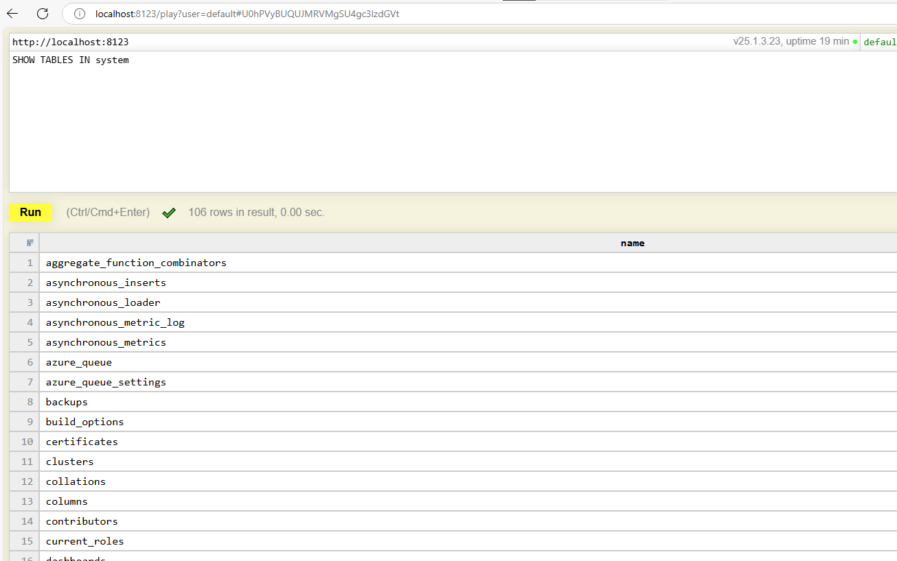

# Install Clickhouse via Helm

[Clickhouse Operator](https://blog.duyet.net/2024/03/clickhouse-on-kubernetes.html)

tldr:

```sh
helm repo add clickhouse-operator https://docs.altinity.com/clickhouse-operator
```

```sh
helm upgrade --install clickhouse-operator clickhouse-operator/altinity-clickhouse-operator
```

```sh
kubectl get pods
```

Deploy first single node clickhouse

[clickhouse.yaml](/k8s/clickhouse.yaml)

```sh
kubectl apply -f clickhouse.yaml
```

```sh
kubectl get po 
```

```sh
kubectl get svc
```

Post-forward playground

```sh
kubectl port-forward svc/clickhouse-single 8123
```

Go to [http://localhost:8123/play](http://localhost:8123/play)



Built-in dashboard

Go to [http://localhost:8123/dashboard](http://localhost:8123/dashboard)

```sh
kubectl describe svc/clickhouse-single
```

```md
Name:                     clickhouse-single
Namespace:                my-iot
Labels:                   clickhouse.altinity.com/Service=chi
                          clickhouse.altinity.com/app=chop
                          clickhouse.altinity.com/chi=single
                          clickhouse.altinity.com/namespace=my-iot
                          clickhouse.altinity.com/object-version=6b185272400c11c1640f618ffa5492a27e0f62ef
Annotations:              <none>
Selector:                 clickhouse.altinity.com/app=chop,clickhouse.altinity.com/chi=single,clickhouse.altinity.com/namespace=my-iot,clickhouse.altinity.com/ready=yes
Type:                     ClusterIP
IP Family Policy:         SingleStack
IP Families:              IPv4
IP:                       None
IPs:                      None
Port:                     http  8123/TCP
TargetPort:               http/TCP
Endpoints:                10.244.0.31:8123 // 🔴 here it is
Port:                     tcp  9000/TCP
TargetPort:               tcp/TCP
Endpoints:                10.244.0.31:9000
Session Affinity:         None
Internal Traffic Policy:  Cluster
Events:                   <none>
```

Use **Endpoints** to fill in Superset hostname